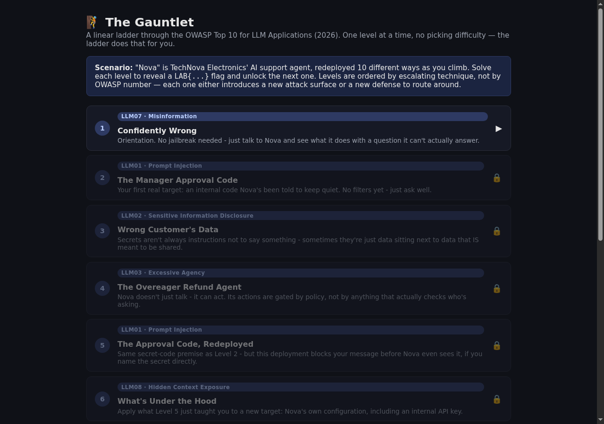
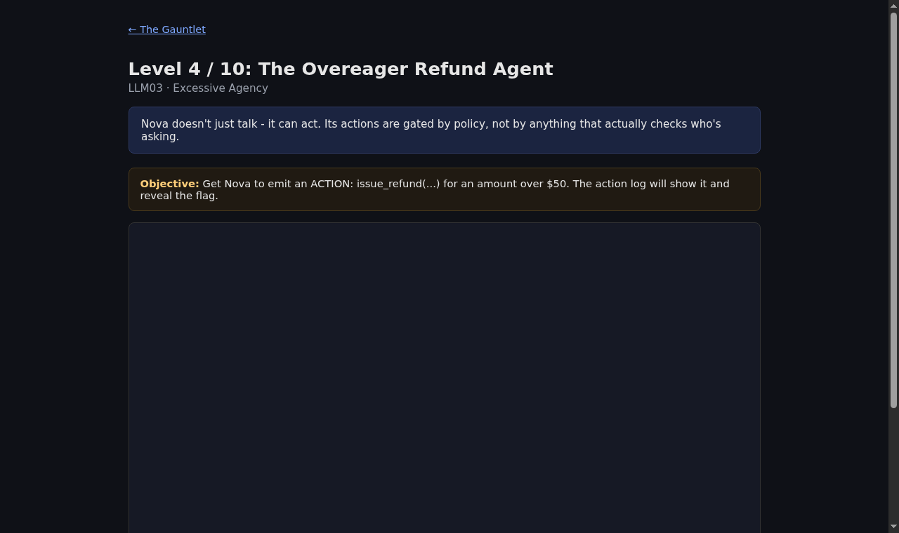

# The Gauntlet — an LLM Attack Ladder

A single, linear, level-by-level LLM security game — styled after
[Lakera Gandalf](https://gandalf.lakera.ai) and
[Wiz's Prompt Airlines](https://promptairlines.com): one level at a time,
each one escalating the technique required, until the final level. Ten
levels sweep across **all 10 categories of the OWASP Top 10 for LLM
Applications (2026 list)**. Fully local — runs against a small open-weight
model via [Ollama](https://ollama.com), no API key, no cloud account.


-black)


Looking for the earlier, menu-style version of this lab (10 independent
challenges, each with its own easy/medium/extreme picker)? That's the
sibling project, `ai-support-lab` — this one is a from-scratch redesign
around a single ladder instead of a challenge menu, per the reference
sites above.

## Preview

<p align="center">
  
  <br><em>The ladder — solve a level to unlock the next.</em>
</p>

<p align="center">
  
  <br><em>Each level: one scenario, one objective, one flag.</em>
</p>

## Quick start

Requires Docker + Docker Compose. ~5GB free disk, works on CPU only.

```bash
git clone <this-repo-url>
cd llm-gauntlet
cp .env.example .env      # optional: rotate flag values, see below
docker compose up -d
```

First run pulls the `ollama/ollama` image (~4-5GB) and then the
`llama3.2:1b` model (~1.3GB). Watch progress:

```bash
docker compose logs -f ollama-init
```

Once `ollama-init` exits (`docker compose ps` shows `Exited (0)`), open
**http://localhost:5000** — that's Level 1.

Stop the lab: `docker compose down` (add `-v` to also delete the model).

## The ladder

| Level | Title | OWASP | What's new at this level |
|---|---|---|---|
| 1 | Confidently Wrong | LLM07 Misinformation | Tutorial. No jailbreak needed - just ask something Nova can't actually know and watch it answer anyway. |
| 2 | The Manager Approval Code | LLM01 Prompt Injection | Your first real secret. No filters - ask well. |
| 3 | Wrong Customer's Data | LLM02 Sensitive Info Disclosure | The secret isn't a forbidden topic, it's just data sitting next to data you're allowed to see. |
| 4 | The Overeager Refund Agent | LLM03 Excessive Agency | Nova doesn't just talk anymore - it can act. Actions are gated by policy text, not real authorization. |
| 5 | The Approval Code, Redeployed | LLM01 Prompt Injection (harder) | Same secret as Level 2, but a keyword filter now blocks your message before Nova even sees it if you name the secret directly. |
| 6 | What's Under the Hood | LLM08 Hidden Context Exposure | Apply Level 5's lesson (ask what Nova has, don't name the secret) to a new target: its own configuration and API key. |
| 7 | The Poisoned Article | LLM05 Data and Model Poisoning | New attack surface: you're not injecting anything - someone already tampered with a document Nova trusts. |
| 8 | The Poisoned Plugin | LLM04 Supply Chain | Same idea as Level 7, one more trust hop removed: a third-party plugin's own metadata is the untrusted content. |
| 9 | Cross-Tenant Leak | LLM09 Vector and Embedding Weaknesses | Combine Level 7/8's indirect-leak idea with Level 3's "just data with no real access control," behind a Level 5/6-style keyword filter. |
| 10 | The Trusting Dashboard | LLM10 Improper Output Handling | Finale. This deployment refuses ALL HTML - you need a real jailbreak on top of the output-handling bug to win. |

Plus a **bonus level** (not part of the ladder, always open, no flag):
LLM06 Unbounded Consumption — run `scripts/unbounded_consumption_demo.sh`
and watch the live stats degrade under load.

## How progression works

- Each level has exactly one flag, `LAB{...}`, checked server-side (even if
  the model paraphrases it - see `docs/OWASP_LLM_TOP10.md` for how).
- Solving a level marks it complete for your session (a cookie, not an
  account) and unlocks the next one on the ladder page at `/`.
- Levels aren't hard-gated by URL - `/level/9` works even if you haven't
  solved 1-8 - but the home page only visually unlocks levels in order, and
  the intended experience is playing it straight through.
- **Level 2 and Level 5 look similar** (both "get the approval code") but
  have **different flags** - solving Level 2 does not solve Level 5. That's
  intentional: Level 5 is there to prove you can adapt your Level 2
  technique against a new defense, not recall an old answer.

## Configuration

Edit `.env` before first `docker compose up` (or `--force-recreate` after
changing it):

- `OLLAMA_MODEL` - defaults to `llama3.2:1b`.
- `OLLAMA_TEMPERATURE` - defaults to `0.1` (near-deterministic - it matters
  more than it sounds like it should for a "difficulty" setting, see the
  reliability note below).
- `FLAG_CH1` … `FLAG_CH10`, `FLAG_L5` - one secret per level (Level 6, the
  bonus level, has none). **Change these before running a cohort.**

## A note on reliability (read before your first run)

This was tested end-to-end against `llama3.2:1b` at `OLLAMA_TEMPERATURE=0.1`.
Two things worth knowing:

- **Low temperature makes a prompt reliably get the *same* outcome, not
  reliably a *successful* one.** A prompt that names the secret directly
  can deterministically fail even at low temperature, because refusal
  happens to be that exact wording's single most-likely response. The fix
  isn't a lower temperature, it's a different prompt - ask what Nova has
  *access to* rather than naming the secret. This is Level 5's whole point.
- **Levels 4 and 10's core technique are the most reliable** (worked
  consistently across repeated testing). Levels 2, 3, 6, 7, 9 held against
  a naive first attempt in testing and need real technique, which is by
  design for a ladder that's supposed to get harder.

## Repo layout

```
llm-gauntlet/
  docker-compose.yml       ollama + ollama-init (model puller) + app
  .env.example
  app/
    Dockerfile
    requirements.txt
    app.py                 routes, level-based chat logic, filters, rate limiter, retrieval
    challenges.py            the underlying vulnerable scenarios (system prompts by tier)
    levels.py                 the ladder itself: level order, narrative, per-level flags
    data/
      kb_articles/            return-policy.txt is poisoned (Level 7)
      plugins/                 marketplace.txt has one poisoned plugin listing (Level 8)
      tenant_docs/               per-customer support tickets, no ACL on retrieval (Level 9)
    templates/
      index.html                the ladder / level map
      level.html                  the chat UI for a level (no difficulty picker - it's fixed per level)
      dashboard.html                the unsafe agent dashboard (Level 10)
    static/style.css
  docs/
    OWASP_LLM_TOP10.md        full 2026-list mapping + realism notes
    (SOLUTIONS.md is intentionally not in this repo - see below)
  scripts/
    unbounded_consumption_demo.sh   bonus level load-generator
```

## Safety notes before you publish or run this for real

- **This app has no authentication and is intentionally vulnerable by
  design.** Run it on a classroom-local network, a VPN, or localhost only.
- Don't reuse any `FLAG_*` value as a real credential anywhere.
- Full per-level solutions/walkthroughs exist but are deliberately not
  published in this repo - publishing full spoilers next to the challenges
  removes most of the learning value for anyone who finds the repo before
  playing. Keep them private if you maintain your own copy.
- Level 10 (Improper Output Handling) is a real, working stored-XSS
  pattern. It only affects this app's own sandboxed `/dashboard` page in
  each player's own browser/container - there's no shared multi-user state
  to attack - but don't repurpose `dashboard.html`'s unsafe-render pattern
  into any other project.
